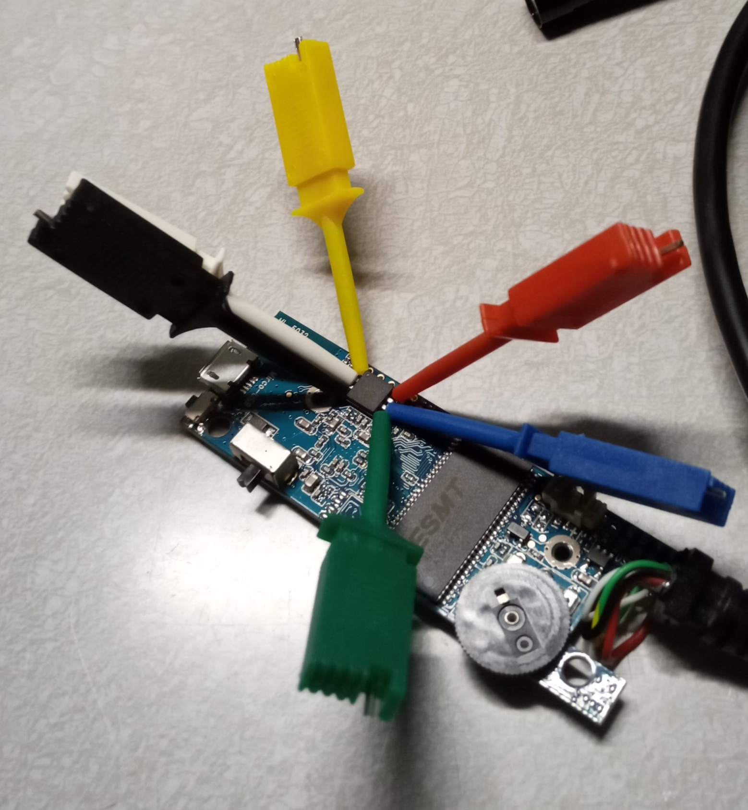

# MSP430 exfiltrator for Winbond Flash chips

This is a simple POC for SPI communication between a TI MSP430G2553 microcontroller and Winbond W25Q32JV flash chip. Having no prior experience with SPI and limited experience with the MSP430, this project was both challenging and rewarding.

If you truly wish to run this code, you'll most likely need to modify the Makefile unless you're running Arch with the `msp430-elf-*` toolchain packages from the AUR. (I use arch btw)

## Referenced Datasheets

Throughout my code there are several comments referencing datasheet sources:

- [SLAS735J - MSP430G2x53 Datasheet](https://www.ti.com/lit/ds/symlink/msp430g2553.pdf)
- [SLAU144J - MSP430x2xx Family User's Guide](https://www.ti.com/lit/ug/slau144j/slau144j.pdf)
- [W25Q32JV Datasheet](https://www.winbond.com/resource-files/W25Q32JV%20RevI%2005042021%20Plus.pdf)


## Background
I bought a cheap wireless camera off Amazon, and it had a hardcoded password of `12345678'. It had a couple open ports, a flash chip (W25Q32JV), and a Ralink chip. Knowing this, I wanted to find out more about its inner workings, so I cobbled together this code for an MSP430 to communicate with the flash chip via SPI. Ideally, I would have used an SOIC-8 clip, but I made do with what I had.

<p align="middle">
  
   
</p>

## Results
```
$ binwalk dump.bin 

DECIMAL       HEXADECIMAL     DESCRIPTION
--------------------------------------------------------------------------------
0             0x0             uImage header, header size: 64 bytes, header CRC: 0x7EBF92E6, created: 2013-09-02 14:03:02, image size: 81904 bytes, Data Address: 0x80200000, Entry Point: 0x80200000, data CRC: 0x739ABB93, OS: Linux, CPU: MIPS, image type: Standalone Program, compression type: none, image name: "SPI Flash Image"
69296         0x10EB0         U-Boot version string, "U-Boot 1.1.3 (Sep  2 2013 - 22:03:00)"
327680        0x50000         uImage header, header size: 64 bytes, header CRC: 0x24EF36B4, created: 2017-07-30 08:41:54, image size: 1578918 bytes, Data Address: 0x80000000, Entry Point: 0x8031F000, data CRC: 0x67F11261, OS: Linux, CPU: MIPS, image type: OS Kernel Image, compression type: lzma, image name: "Linux Kernel Image"
327744        0x50040         LZMA compressed data, properties: 0x5D, dictionary size: 33554432 bytes, uncompressed size: 3926339 bytes
```

It runs Linux! Extracting the rootfs cpio yielded the expected hardcoded WLAN configs and some binary blobs of interest. It also revealed that the software running on the camera was constructed with a proprietary Mediatek Ralink SDK. I trawled through Google results and open directories for hours with snippets from obvious template files in the cpio and eventually found the SDK.